<a id="readme-top"></a>

<!-- PROJECT LOGO & TITLE -->

<div align="center">
  <a href="https://github.com/opencloudhub">
  <picture>
    <source media="(prefers-color-scheme: light)" srcset="https://raw.githubusercontent.com/opencloudhub/.github/main/assets/brand/assets/logos/primary-logo-light.svg">
    <source media="(prefers-color-scheme: dark)" srcset="https://raw.githubusercontent.com/opencloudhub/.github/main/assets/brand/assets/logos/primary-logo-dark.svg">
    <!-- Fallback -->
    
  </picture>
  </a>

<h1 align="center">Emotion Classification — Hyperparameter Optimization Demo</h1>

<p align="center">
    Ray Tune hyperparameter optimization with DistilBERT, demonstrating MLflow nested runs, ASHA scheduling, and efficient trial management.<br />
    <a href="https://github.com/opencloudhub"><strong>Explore OpenCloudHub »</strong></a>
  </p>
</div>

______________________________________________________________________

<details>
  <summary>📑 Table of Contents</summary>
  <ol>
    <li><a href="#about">About</a></li>
    <li><a href="#thesis-context">Thesis Context</a></li>
    <li><a href="#architecture">Architecture</a></li>
    <li><a href="#code-structure">Code Structure</a></li>
    <li><a href="#getting-started">Getting Started</a></li>
    <li><a href="#infrastructure">Infrastructure Options</a></li>
    <li><a href="#usage">Usage</a></li>
    <li><a href="#configuration">Configuration</a></li>
    <li><a href="#workflow-tags">Workflow Tags & Traceability</a></li>
    <li><a href="#contributing">Contributing</a></li>
    <li><a href="#license">License</a></li>
  </ol>
</details>

______________________________________________________________________

<h2 id="about">🎯 About</h2>

This repository demonstrates **hyperparameter optimization** for transformer-based models using Ray Tune and DistilBERT. The focus is on demonstrating efficiently searching hyperparameter spaces while maintaining clean experiment organization through MLflow's nested run hierarchy.

The pipeline demonstrates:

- **Hyperparameter Search** — Ray Tune explores learning rate, batch size, and other parameters in parallel
- **ASHA Scheduling** — Asynchronous Successive Halving terminates underperforming trials early
- **Nested MLflow Runs** — Parent run contains search metadata; child runs track individual trials
- **Transformers Integration** — Fine-tuning HuggingFace DistilBERT on emotion classification
- **Best Model Selection** — Automatic registration of the best trial's model to MLflow Registry

______________________________________________________________________

<h2 id="thesis-context">📚 Thesis Context</h2>

This repository is part of a Master's thesis: **"A Scalable MLOps System for Multimodal Educational Analysis"** at Goethe University Frankfurt / DIPF Leibniz Institute.

### Role in the Platform

This workload introduces **hyperparameter optimization** to the platform demonstration. While [ai-dl-lightning](https://github.com/opencloudhub/ai-dl-lightning) showed distributed training with fixed hyperparameters, this repo demonstrates automated hyperparameter search with intelligent trial scheduling.

The emotion classification task uses DistilBERT from HuggingFace Transformers, validating that the platform supports fine-tuning pre-trained models — a common pattern in production ML workflows.

This workload is demonstrated running **locally** to show the development workflow, but the same patterns apply when running as a RayJob on the cluster.

### Requirements Addressed

| Req ID   | Requirement                 | Implementation                                                |
| -------- | --------------------------- | ------------------------------------------------------------- |
| **FR1**  | Experiment Tracking         | MLflow nested runs (parent for search, children for trials)   |
| **FR2**  | Data Versioning             | DVC-versioned emotion dataset from data-registry              |
| **FR3**  | Model Registry              | Best trial automatically registered with label mappings       |
| **FR5**  | Model Serving               | Ray Serve loads model + labels from MLflow artifacts          |
| **FR6**  | Framework Agnosticism       | Validates HuggingFace Transformers alongside sklearn/PyTorch  |
| **FR8**  | Hyperparameter Optimization | Ray Tune with ASHA scheduler, configurable search space       |
| **FR15** | CI/CD Integration           | Can trigger via GitHub Actions → Argo Workflows               |
| **NFR1** | End-to-End Lineage          | Best trial linked to parent run; workflow tags preserved      |
| **NFR2** | Reproducibility             | Search space and scheduler config logged; trials reproducible |
| **NFR4** | Resource Efficiency         | ASHA terminates poor trials early, saving compute             |
| **C1**   | Open-Source Only            | Ray Tune, HuggingFace Transformers — permissive licenses      |

### Key Differentiators from Previous Workloads

| Aspect       | ai-dl-lightning        | ai-dl-bert (This Repo)        |
| ------------ | ---------------------- | ----------------------------- |
| Training     | Fixed hyperparameters  | Hyperparameter search         |
| Model        | Custom ResNet18        | Pre-trained DistilBERT        |
| Modality     | Images (Fashion MNIST) | Text (Emotion classification) |
| Scheduler    | None                   | ASHA (early stopping)         |
| MLflow Runs  | Single run             | Nested parent/child runs      |
| Primary Demo | Distributed DDP        | Local HPO workflow            |

### Integration Patterns Demonstrated

```
┌─────────────────┐     ┌────────────────────┐     ┌─────────────────┐
│  data-registry  │────▶│    ai-dl-bert      │────▶│     gitops      │
│                 │     │    (this repo)     │     │                 │
│  - train.parquet│     │                    │     │  - RayService   │
│  - val.parquet  │     │  Ray Tune Driver   │     │    manifest     │
│  - metadata.json│     │  ┌──────────────┐  │     │                 │
│    (labels)     │     │  │Parent MLflow │  │     │                 │
└─────────────────┘     │  │  ├─Trial 1   │  │     └─────────────────┘
                        │  │  ├─Trial 2   │  │
                        │  │  └─Trial N   │  │
                        │  └──────────────┘  │
                        └────────────────────┘
```

### Related Components

| Component                | Repository                                                                 | Relationship                                             |
| ------------------------ | -------------------------------------------------------------------------- | -------------------------------------------------------- |
| **Data Source**          | [data-registry](https://github.com/opencloudhub/data-registry)             | DVC-versioned emotion dataset (Parquet + label mappings) |
| **Workflow Templates**   | [gitops](https://github.com/opencloudhub/gitops)                           | Argo Workflow templates for cluster execution            |
| **Deployment Manifests** | [gitops](https://github.com/opencloudhub/gitops)                           | RayService YAML for model serving                        |
| **Local Stack**          | [local-compose-stack](https://github.com/opencloudhub/local-compose-stack) | MLflow + MinIO for local development                     |

______________________________________________________________________

<h2 id="architecture">🏗️ Architecture</h2>

### Hyperparameter Search Flow


### ASHA Early Stopping

```mermaid
flowchart LR
    subgraph epoch1["Epoch 1"]
        E1T1[Trial 1: loss=0.8]
        E1T2[Trial 2: loss=0.6]
        E1T3[Trial 3: loss=0.9]
        E1T4[Trial 4: loss=0.7]
    end

    subgraph epoch2["Epoch 2"]
        E2T1[Trial 1: loss=0.5]
        E2T2[Trial 2: loss=0.4]
        E2T4[Trial 4: loss=0.45]
        E2T3X[Trial 3: STOPPED]
    end

    subgraph epoch3["Epoch 3"]
        E3T2[Trial 2: loss=0.35 ★]
        E3T1X[Trial 1: STOPPED]
        E3T4X[Trial 4: STOPPED]
    end

    E1T1 --> E2T1 --> E3T1X
    E1T2 --> E2T2 --> E3T2
    E1T3 --> E2T3X
    E1T4 --> E2T4 --> E3T4X

    style E2T3X fill:#ffcccc
    style E3T1X fill:#ffcccc
    style E3T4X fill:#ffcccc
    style E3T2 fill:#ccffcc
```



ASHA (Asynchronous Successive Halving Algorithm) terminates underperforming trials early based on intermediate metrics, allowing compute resources to focus on promising configurations.

### MLflow Nested Run Hierarchy

```mermaid
flowchart TB
    subgraph mlflow_ui["MLflow Experiment: emotion"]
        PARENT["🔵 Parent Run: hyperparameter_search_20241117_143022
        ├── tags: argo_workflow_uid, docker_image_tag, dvc_data_version
        ├── params: num_samples, scheduler, search_space
        └── metrics: best_val_loss, best_trial_id"]

        CHILD1["  └─ 🟢 Child: trial_0
              ├── params: lr=2e-5, batch_size=16
              └── metrics: val_loss=0.42, val_acc=0.88"]

        CHILD2["  └─ 🟢 Child: trial_1 ★ BEST
              ├── params: lr=5e-5, batch_size=32
              └── metrics: val_loss=0.35, val_acc=0.91"]

        CHILD3["  └─ 🔴 Child: trial_2 (stopped early)
              ├── params: lr=1e-4, batch_size=16
              └── metrics: val_loss=0.65, val_acc=0.78"]
    end

    PARENT --> CHILD1
    PARENT --> CHILD2
    PARENT --> CHILD3
```



This hierarchy enables:

- **Comparing trials** within a single parent run
- **Tracing the best model** back to its trial and parent
- **Filtering experiments** by search metadata (date, scheduler type)

### Ray Tune + Lightning + MLflow Integration


______________________________________________________________________

<h2 id="code-structure">📂 Code Structure</h2>

Each file includes detailed header comments explaining its purpose and integration points.

### Project Layout

```
ai-dl-bert/
├── src/
│   ├── training/                   # HPO and training pipeline
│   │   ├── tune.py                 # Ray Tune driver + MLflow integration
│   │   ├── model.py                # PyTorch Lightning DistilBERT module
│   │   ├── data.py                 # DVC data loading + tokenization
│   │   └── config.py               # Pydantic configuration
│   ├── serving/                    # Model serving
│   │   ├── serve.py                # Ray Serve + FastAPI deployment
│   │   ├── schemas.py              # Request/response models
│   │   └── config.py               # Serving configuration
│   └── _utils/
│       └── logging.py              # Rich logging utilities
├── .github/workflows/
│   ├── ci-code-quality.yaml        # Linting, type checks
│   ├── ci-docker-build-push.yaml   # Multi-stage Docker builds
│   └── train.yaml                  # MLOps pipeline trigger
├── Dockerfile                      # Multi-stage: training + serving
├── .env.docker                     # Local compose environment
├── .env.minikube                   # Minikube environment
└── pyproject.toml                  # UV package configuration
```

### Training Module (`src/training/`)

#### `tune.py` — Ray Tune Driver

The main hyperparameter search script:

```python
# Key responsibilities:
# 1. Create parent MLflow run for the search
# 2. Define search space (lr, batch_size, weight_decay, etc.)
# 3. Configure ASHA scheduler for early stopping
# 4. Launch parallel trials via Ray Tune
# 5. Register best model to MLflow Registry
# 6. Log label mappings as artifact
```

**Search Space Definition:**

```python
search_space = {
    "lr": tune.loguniform(1e-5, 1e-4),  # Log-uniform for learning rates
    "batch_size": tune.choice([16, 32]),  # Discrete choices
    "weight_decay": tune.uniform(0.0, 0.1),  # Uniform for regularization
}
```

**ASHA Scheduler Configuration:**

```python
scheduler = ASHAScheduler(
    metric="val_loss",  # Metric to optimize
    mode="min",  # Minimize validation loss
    max_t=max_epochs,  # Maximum epochs per trial
    grace_period=1,  # Minimum epochs before stopping
    reduction_factor=2,  # Halving factor
)
```

**MLflow Nested Run Pattern:**

```python
with mlflow.start_run(run_name=f"hpo_search_{timestamp}") as parent_run:
    mlflow.set_tags(WORKFLOW_TAGS.model_dump())  # Traceability

    # Each trial creates a nested child run
    def train_func(config):
        with mlflow.start_run(nested=True):
            # Training loop with metric logging
            ...

    results = tuner.fit()

    # Register best model under parent run
    best_result = results.get_best_result()
    mlflow.pytorch.log_model(best_model, registered_model_name=...)
```

#### `model.py` — PyTorch Lightning Module

DistilBERT classifier with multi-class emotion prediction:

```python
# EmotionClassifier(LightningModule):
#
# Architecture:
#   - DistilBERT backbone (distilbert-base-uncased)
#   - Classification head: 768 → num_classes
#
# Forward pass:
#   input_ids → DistilBERT → [CLS] embedding → Linear → logits
#
# Metrics:
#   - CrossEntropyLoss
#   - Accuracy (torchmetrics)
#   - F1 Score (macro average)
#
# Ray Tune integration:
#   - TuneReportCheckpointCallback reports metrics
#   - Checkpoints saved for best trial recovery
```

**Callback Configuration:**

```python
# TuneReportCheckpointCallback bridges Lightning and Ray Tune
callbacks = [
    TuneReportCheckpointCallback(
        metrics={"val_loss": "val_loss", "val_acc": "val_accuracy"},
        on="validation_end",
    )
]
```

#### `data.py` — Data Loading and Tokenization

```python
# Key functions:
#
# load_data(version: str) -> Tuple[Dataset, Dataset, Dict]:
#     1. Fetch train/val Parquet from DVC
#     2. Load metadata.json with label mappings
#     3. Tokenize texts using DistilBERT tokenizer
#     4. Return PyTorch Datasets + label_map
#
# EmotionDataset(Dataset):
#     - Stores tokenized inputs + labels
#     - __getitem__ returns dict for model forward pass
```

**Label Mapping Pattern:**

```python
# metadata.json (in DVC):
{
    "label_map": {
        "0": "sadness",
        "1": "joy",
        "2": "love",
        "3": "anger",
        "4": "fear",
        "5": "surprise",
    }
}

# Logged as artifact for serving to use
mlflow.log_artifact("labels.json")
```

### Serving Module (`src/serving/`)

#### `serve.py` — Ray Serve Deployment

```python
# EmotionClassifierDeployment:
#
# __init__(model_uri: str):
#     1. Load model from MLflow registry
#     2. Load labels.json artifact from same run
#     3. Initialize tokenizer (DistilBERT)
#
# predict(texts: List[str]) -> List[EmotionPrediction]:
#     1. Tokenize input texts
#     2. Forward pass through model
#     3. Map indices to emotion labels
#     4. Return predictions with confidence scores
#
# /info endpoint:
#     - Model URI and version
#     - Training run ID
#     - Label mappings
#     - DVC data version
```

### CI/CD Workflows

#### `train.yaml` — MLOps Pipeline

```yaml
# Workflow dispatch inputs:
#   - dvc_data_version: Dataset version (e.g., emotion-v1.0.0)
#   - num_samples: Number of HPO trials
#   - max_epochs: Maximum epochs per trial
#
# Can run locally for development or trigger Argo Workflow for cluster execution
```

______________________________________________________________________

<h2 id="getting-started">🚀 Getting Started</h2>

### Prerequisites

- Docker
- VS Code with DevContainers extension (recommended)

### Setup

1. **Clone the repository**

   ```bash
   git clone https://github.com/opencloudhub/ai-dl-bert.git
   cd ai-dl-bert
   ```

1. **Open in DevContainer** (Recommended)

   VSCode: `Ctrl+Shift+P` → `Dev Containers: Rebuild and Reopen in Container`

   Or **setup locally**:

   ```bash
   curl -LsSf https://astral.sh/uv/install.sh | sh
   uv sync --dev
   ```

1. **Choose infrastructure backend** (see next section)

______________________________________________________________________

<h2 id="infrastructure">🛠️ Infrastructure Options</h2>

### Option 1: Local Compose Stack

For quick iterations without Kubernetes. Provides MLflow and MinIO via Docker Compose.

```bash
# Start MLflow + MinIO
git clone https://github.com/OpenCloudHub/local-compose-stack.git
cd local-compose-stack && docker compose up -d

# Configure and run
cd ../ai-dl-bert
set -a && source .env.docker && set +a
ray start --head --num-cpus 8
```

**Available Services:**

| Service       | URL                   |
| ------------- | --------------------- |
| MLflow UI     | http://localhost:5000 |
| MinIO Console | http://localhost:9001 |
| Ray Dashboard | http://localhost:8265 |

### Option 2: Local Development with Minikube Backend

Run HPO locally while using platform services deployed on Minikube.

```bash
set -a && source .env.minikube && set +a
ray start --head --num-cpus 8

# Run hyperparameter search locally
python src/training/tune.py --num-samples 4 --num-epochs 3
```

Requires the OpenCloudHub platform deployed via the [gitops](https://github.com/opencloudhub/gitops) repository.

### Option 3: Full Cluster Execution

HPO runs as a RayJob on Kubernetes, triggered via CI/CD.

**Trigger training:** [Actions → MLOps Pipeline](https://github.com/OpenCloudHub/ai-dl-bert/actions/workflows/train.yaml)

**Flow:** GitHub Actions → Argo Workflows → RayJob (HPO) → MLflow Registry → RayService (serving)

______________________________________________________________________

<h2 id="usage">📖 Usage</h2>

### Hyperparameter Search

```bash
# Quick search (4 trials, 3 epochs each)
python src/training/tune.py --num-samples 4 --num-epochs 3 --limit 500

# Demo
python src/training/tune.py --num-epochs 10 --num-samples 4 --limit 2000

# Full search (more trials, more epochs)
python src/training/tune.py --num-samples 16 --num-epochs 10

# Via Ray Job API
RAY_ADDRESS='http://127.0.0.1:8265' ray job submit --working-dir . -- \
    python src/training/tune.py --num-samples 8 --num-epochs 5
```

**CLI Arguments:**

| Argument        | Default | Description                            |
| --------------- | ------- | -------------------------------------- |
| `--num-samples` | `2`     | Number of HPO trials                   |
| `--num-epochs`  | `3`     | Maximum epochs per trial               |
| `--limit`       | `None`  | Limit dataset size (for quick testing) |

**What happens during search:**

1. Parent MLflow run created with search metadata
1. Ray Tune launches parallel trials
1. Each trial creates nested MLflow child run
1. ASHA scheduler terminates underperforming trials
1. Best model registered to MLflow Registry
1. Label mappings saved as artifact

### Viewing Results

**MLflow UI:** `http://localhost:5000`

- Navigate to `emotion` experiment
- Parent run contains all trials as nested runs
- Compare trials by metrics (val_loss, val_accuracy)
- View registered model in Model Registry

**Ray Dashboard:** `http://localhost:8265`

- Monitor trial progress
- View resource utilization
- Check logs for individual trials

### Serving

```bash
# Development with hot-reload
serve run src.serving.serve:app_builder model_uri="models:/ci.emotion-classifier/1" --reload

# Access API docs
open http://localhost:8000/docs
```

**Endpoints:**

| Endpoint   | Method | Description                     |
| ---------- | ------ | ------------------------------- |
| `/`        | GET    | Service info                    |
| `/health`  | GET    | Liveness probe                  |
| `/info`    | GET    | Model metadata + emotion labels |
| `/predict` | POST   | Emotion classification          |

**Example Request:**

```bash
curl -X POST http://localhost:8000/predict \
  -H "Content-Type: application/json" \
  -d '{"texts": ["I love this!", "This makes me angry", "I am so scared"]}'
```

**Example Response:**

```json
{
  "predictions": [
    {"text": "I love this!", "emotion": "joy", "confidence": 0.94},
    {"text": "This makes me angry", "emotion": "anger", "confidence": 0.89},
    {"text": "I am so scared", "emotion": "fear", "confidence": 0.87}
  ],
  "model_uri": "models:/ci.emotion-classifier/1"
}
```

______________________________________________________________________

<h2 id="configuration">⚙️ Configuration</h2>

### Required Environment Variables

| Variable                 | Description                | Local Value             |
| ------------------------ | -------------------------- | ----------------------- |
| `MLFLOW_TRACKING_URI`    | MLflow server URL          | `http://localhost:5000` |
| `MLFLOW_EXPERIMENT_NAME` | Experiment name            | `emotion`               |
| `DVC_DATA_VERSION`       | Dataset version            | `emotion-v1.0.0`        |
| `ARGO_WORKFLOW_UID`      | Workflow identifier        | `DEV`                   |
| `DOCKER_IMAGE_TAG`       | Image tag for traceability | `DEV`                   |
| `AWS_ACCESS_KEY_ID`      | MinIO access key           | from `.env.*`           |
| `AWS_SECRET_ACCESS_KEY`  | MinIO secret               | from `.env.*`           |

### Configuration Files

- **`.env.docker`** — Local compose stack settings
- **`.env.minikube`** — Minikube/Kubernetes settings
- **`src/training/config.py`** — Training defaults (model name, search space)
- **`src/serving/config.py`** — Serving limits (max sequence length)

______________________________________________________________________

<h2 id="workflow-tags">🏷️ Workflow Tags & Traceability</h2>

Every hyperparameter search is tagged with identifiers enabling complete traceability:

| Tag                 | Source                  | Purpose                           |
| ------------------- | ----------------------- | --------------------------------- |
| `argo_workflow_uid` | `ARGO_WORKFLOW_UID` env | Links to Argo Workflows execution |
| `docker_image_tag`  | `DOCKER_IMAGE_TAG` env  | Identifies exact code version     |
| `dvc_data_version`  | `DVC_DATA_VERSION` env  | Identifies dataset version        |

**HPO-Specific Traceability:**

```
MLflow Parent Run (hyperparameter_search)
    ├── tags: argo_workflow_uid, docker_image_tag, dvc_data_version
    ├── params: num_samples, scheduler_type, search_space
    ├── Child Run: trial_0
    │   ├── params: lr, batch_size, weight_decay
    │   └── metrics: val_loss, val_accuracy, epochs_completed
    ├── Child Run: trial_1 (BEST)
    │   └── ...
    └── Registered Model
        ├── model checkpoint
        └── labels.json (emotion mappings)
```

The nested structure allows tracing from deployed model → best trial → search configuration → data version → code version.

______________________________________________________________________

<h2 id="contributing">👥 Contributing</h2>

Contributions welcome! See [Contributing Guidelines](https://github.com/opencloudhub/.github/blob/main/.github/CONTRIBUTING.md) and [Code of Conduct](https://github.com/opencloudhub/.github/blob/main/.github/CODE_OF_CONDUCT.md).

______________________________________________________________________

<h2 id="license">📄 License</h2>

Apache 2.0 License. See [LICENSE](LICENSE).

______________________________________________________________________

<h2 id="acknowledgements">🙏 Acknowledgements</h2>

- [Ray Tune](https://docs.ray.io/en/latest/tune/index.html) — Hyperparameter optimization
- [HuggingFace Transformers](https://huggingface.co/transformers/) — DistilBERT model
- [PyTorch Lightning](https://lightning.ai/) — Structured training loops
- [MLflow](https://mlflow.org/) — Experiment tracking and model registry
- [DVC](https://dvc.org/) — Data version control
- [Emotion Dataset](https://huggingface.co/datasets/dair-ai/emotion) — Training data

<p align="right">(<a href="#readme-top">back to top</a>)</p>
